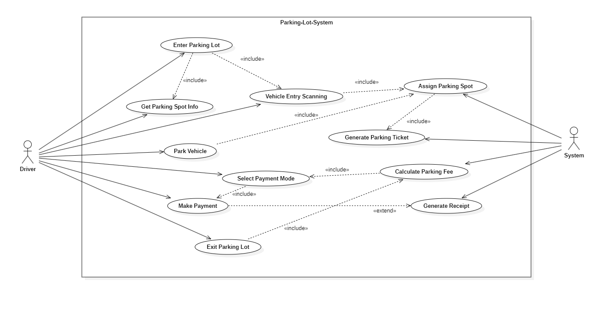

# Parking Lot System - Low Level Design (LLD) <br>

A LLD implementation of real world parking lot management system using OOPS, SOLID principles and Design patterns. <br> <br>

## Problem Statement <br>

Design a Parking Lot System with following Requirements: <br>

- Have Entry and Exit gate. <br>
- Have multiple floors in the parking lot.<br>
- Vehicles Allowed : Motorcycle, Cars, Trucks, Vans. <br>
- Four types of parking spots based on Vehicle Type. <br>
- Disallow vehicle entry if parking lot reaches full capacity. <br>
- A vehicle can be parked only at the spot for its vehicle type. <br>
- Generate parking tickets with duration tracking. <br>
- Payment methods : Cash, Credit Card and UPI. <br>
- Parking charges based on Hourly Rate. <br><br>

## Project Structure <br>

#### parkinglot package <br>
- ParkingLot.java: Manages floors, entry gates, exit gates, and parking spot booking. A singleton class.<br>
- ParkingFloor.java: Manages parking spots and updates its availability. <br>
- ParkingSpot.java: Abstract representation of a parking spot.<br>
- BikeParkingSpot.java, CarParkingSpot.java, OtherParkingSpot.java: Specific implementations for parking spots. <br>
- Ticket.java: Represents a parking ticket issued to a vehicle. <br>

#### vehicle package <br>
- Vehicle.java: Abstract class for vehicles. <br>
- BikeVehicle.java, CarVehicle.java, OtherVehicle.java: Specific implementations for vehicles. <br>
- VehicleFactory.java: Factory class to create vehicle instances based on vehicle type. <br>

#### payment package <br>
- Payment.java: Manages payment logic. <br>
- PaymentStrategy.java: Strategy pattern for payment processing. <br>
- PaymentService.java: Selects and execute the appropriate payment strategy. A singleton class. <br>
- CashPayment.java, CreditCardPayment.java, UPIPayment.java: Specific implementations for payment methods. <br>

#### gates package <br>
- EntranceGate.java: Handles vehicle entry, ticket generation, and parking spot allocation. <br> 
- ExitGate.java: Manages vehicle exit, calculates parking fees, and initiates payment processing. <br>

#### Main.java <br>
- Entry point of application. Contains the main method to initialise and run the parking lot system. <br><br>

## UML Diagrams <br>

### Use Case Diagram <br>
 <br>

### Class Diagram <br>
<br><br>

## Design Patterns used <br>

### Factory Design Pattern <br>
- It provides a way to create objects without exposing the instantiation logic to the client. It promotes loose coupling by delegating the object creation to a specific class. <br>
- In this project, Vehicle Factory is used to create instances of different types of vehicles (Bike, Car, Van, Truck) based on parking requirement. <br>
- Advantage - Extensibility & Loose Coupling. <br>

### Strategy Design Pattern <br>
- It is used to define a group of interchangeable algorithms and choose one at runtime. <br>
- In this project, PaymentStrategy is used to support multiple payment methods like Cash, CreditCard, UPI. PaymentService uses the chosen one at runtime. <br>
- Advantage - Flexible & Interchangeable logic. <br>

### Singleton Design Pattern <br>
- It ensures that only one instance of the class is created in the entire application. Must handle Multithreading case. <br>
- In this project, PaymentService & ParkingLot is implemented as Singleton class to maintain a single instance of it across the system. <br>
- Advantage - Shared instance, Global access. <br> <br>

## How to Run <br>

1. **Prerequisites**: <br>
- Java 17 or later installed. <br>
- VS Code (recommended) or any Java-supported IDE. <br>

2. **Clone the Repository**: <br>
```bash
git clone https://github.com/Ansh2625/Parking-Lot-System.git 
cd Parking-Lot-System
``` 

3. **Import the Project**: <br>
- Open VS Code. <br>
- Select File > Open and choose the project's root folder (Parking-Lot-System). <br>

4. **Build the Project**: <br>
- Open Main.java file inside src. <br>
- Click the Run button on top, or right-click and choose Run java. <br>

5. **Run the Application**: <br>
- Right-click on Main.java. <br>
- Alternatively, use the terminal: <br>
```bash
javac -d bin src/Main.java 
java -cp bin Main
```

6. **Interact with the System**: <br>
- The system simulates parking operations. <br>
- Check console logs for actions like ticket generation, parking spot allocation, and payments. <br> <br>

## Features <br>
- Multi-floor parking lot with entry and exit gates. <br>
- Support different parking spot types (Bike, Car, Van and Truck). <br>
- Dynamic Parking spot allocation. <br>
- Ticket generation for parked vehicles. <br>
- Payment processing via Cash, CrediCard, or UPI. <br>
- Easily extendable and modular codebase. <br><br>