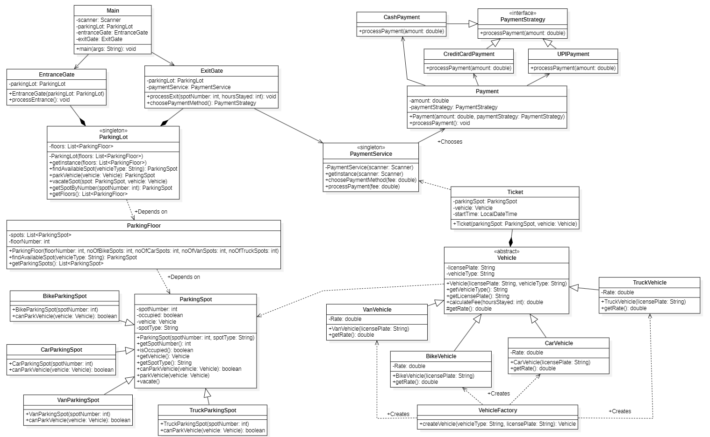

# Parking Lot System - Low Level Design (LLD)  

A LLD implementation of real world parking lot management system using OOPS, SOLID principles and Design patterns.    

## Problem Statement  

Design a Parking Lot System with following Requirements:  

- Have Entry and Exit gate.  
- Have multiple floors in the parking lot. 
- Vehicles Allowed : Motorcycle, Cars, Trucks, Vans.  
- Four types of parking spots based on Vehicle Type.  
- Disallow vehicle entry if parking lot reaches full capacity.  
- A vehicle can be parked only at the spot for its vehicle type.  
- Generate parking tickets with duration tracking.  
- Payment methods : Cash, Credit Card and UPI.  
- Parking charges based on Hourly Rate.   

## UML Diagrams  

### Use Case Diagram  
  

### Class Diagram  
  

## Design Patterns used  

### Factory Design Pattern  
- It provides a way to create objects without exposing the instantiation logic to the client. It promotes loose coupling by delegating the object creation to a specific class.  
- In this project, Vehicle Factory is used to create instances of different types of vehicles (Bike, Car, Van, Truck) based on parking requirement.  
- Advantage - Extensibility & Loose Coupling.  

### Strategy Design Pattern  
- It is used to define a group of interchangeable algorithms and choose one at runtime.  
- In this project, PaymentStrategy is used to support multiple payment methods like Cash, CreditCard, UPI. PaymentService uses the chosen one at runtime.  
- Advantage - Flexible & Interchangeable logic.  